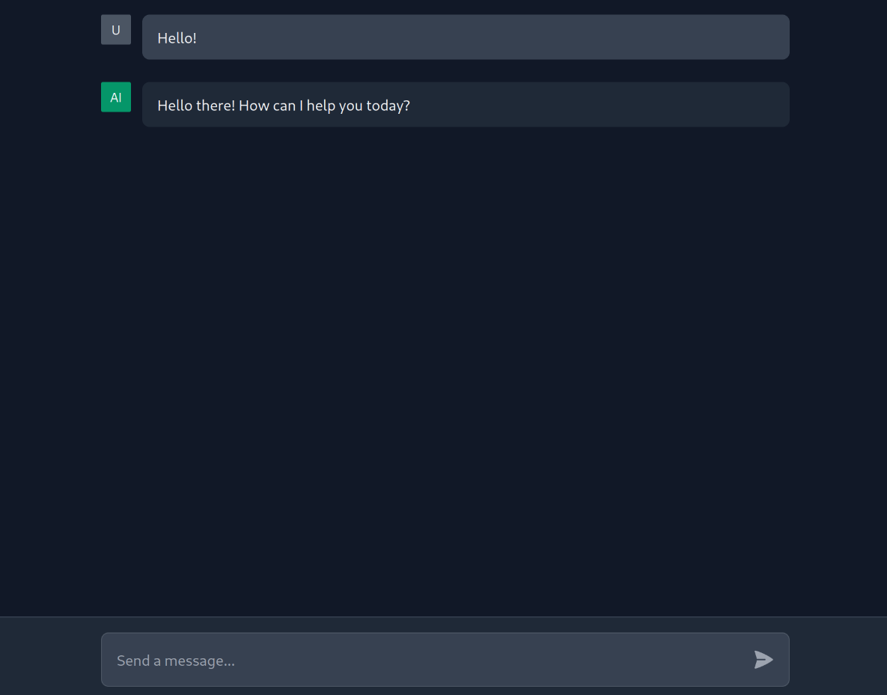

# 🤖 LLM ChatUI

A modern, responsive chat interface for interacting with Large Language Models. Built with Next.js 15, TypeScript, and Tailwind CSS.

## 📸 Screenshots



## ✨ Features

- 💬 Real-time chat interface with AI
- 🎨 Clean and responsive design
- 🌙 Dark mode UI
- 📜 Message history
- 📲 Smooth scrolling to latest messages
- ⚡ Loading states and error handling
- 📝 TypeScript support

## 📋 Prerequisites

- 📦 Node.js (v18 or higher)
- 📦 PNPM package manager
- 🔑 API key for your chosen LLM provider

## 🔐 Environment Variables

Create a `.env.local` file in the root directory with the following variables:

```env
# Configure based on your chosen LLM provider
API_KEY=your_api_key_here
MODEL_NAME=your_model_name
```

## 🚀 Installation

1. Clone the repository:

   ```bash
   git clone [your-repo-url]
   cd [your-repo-name]
   ```

2. Install dependencies:

   ```bash
   pnpm install
   ```

3. For development:

   ```bash
   pnpm dev
   ```

4. For production:

   ```bash
   pnpm run build
   pnpm run start
   ```

5. Open [http://localhost:3000](http://localhost:3000) with your browser to see the result.

## 📁 Project Structure

```plaintext
src/
├── app/
│   ├── api/
│   │   └── chat/        # API endpoint for chat
│   ├── components/
│   │   └── chat/        # Chat UI components
│   └── page.tsx         # Main chat interface
└── types/
    └── chat.ts          # TypeScript definitions
```

## 🛠️ Technology Stack

- ⚛️ [Next.js](https://nextjs.org/) - React framework
- 📘 [TypeScript](https://www.typescriptlang.org/) - Type safety
- 🎨 [Tailwind CSS](https://tailwindcss.com/) - Styling

## 💻 Development

- 🏃‍♂️ Development server: `pnpm dev`
- 🏗️ Build for production: `pnpm run build`
- 🚀 Start production server: `pnpm run start`
- ✨ Lint code: `pnpm run lint`

## 🤝 Contributing

1. Fork the repository
2. Create your feature branch (`git checkout -b feature/amazing-feature`)
3. Commit your changes (`git commit -m 'Add some amazing feature'`)
4. Push to the branch (`git push origin feature/amazing-feature`)
5. Open a Pull Request

## 📄 License

This project is licensed under the MIT License - see the LICENSE file for details.

## 🐛 Bug Reports

If you find any bugs, please create an issue in the GitHub repository.

## 💡 Feature Requests

Have ideas for new features? Feel free to open an issue to discuss them!
